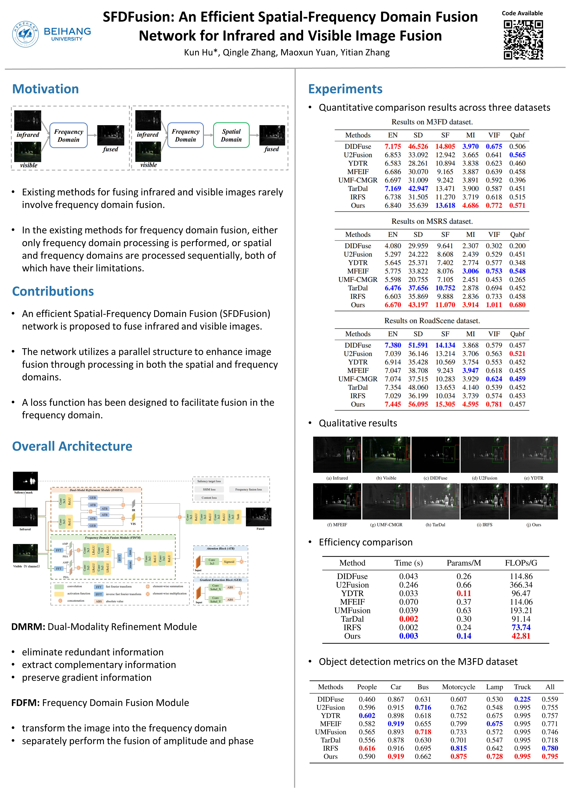

# SFDFusion

Code of "SFDFusion: An Efficient Spatial-Frequency Domain Fusion Network for Infrared and Visible Image Fusion"

Accepted by [ECAI 2024](https://www.ecai2024.eu/programme/accepted-papers)

paper link [[here]](https://ebooks.iospress.nl/doi/10.3233/FAIA240524)



## Environments

```
python 3.10
cuda 11.8
```

## Install

```
conda create -n SFD python=3.10
conda activate SFD
pip install -r requirements.txt
```

## Train

The training process needs wandb API key.
The config file is `./configs/cfg.yaml`

```
python train.py
```

## Inference

```
python fuse.py
```

## Dataset

MSRS dataset is used to train. You can get it from [here](https://pan.baidu.com/s/1IrlqjmyvwWe5OHZEiiAtTA?pwd=e6yg).
